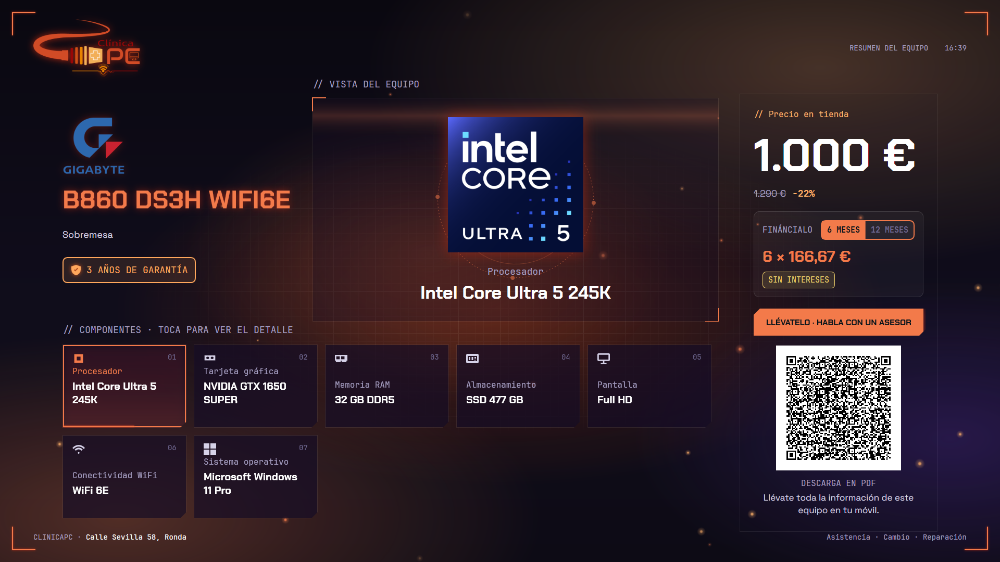
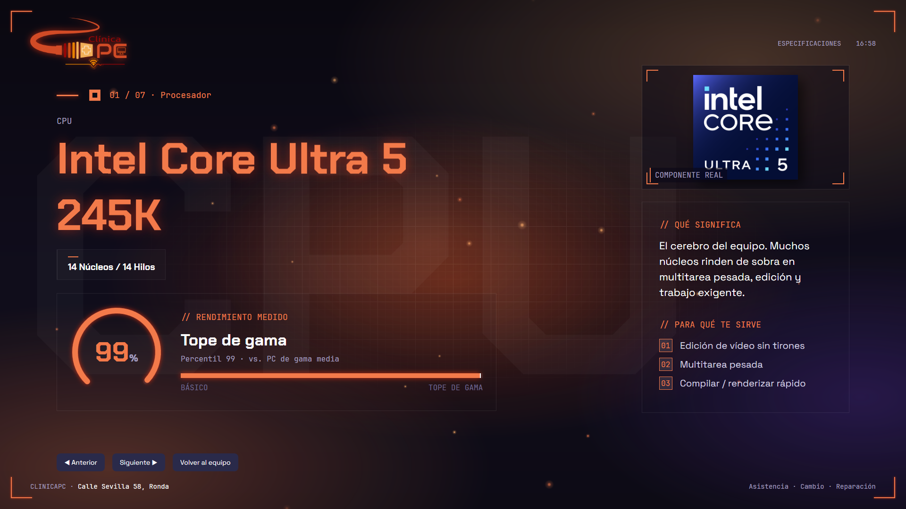
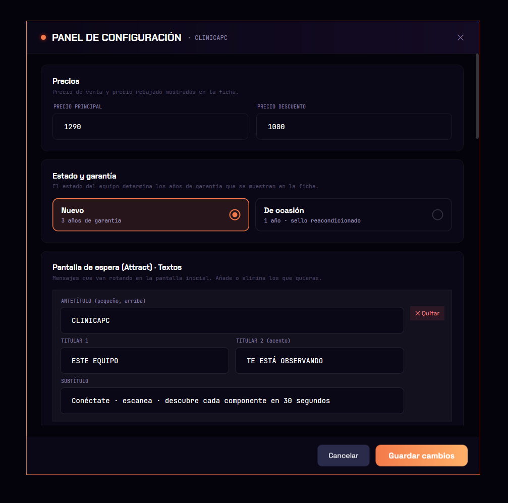

<div align="center">


# KioskClinicaPC

**El kiosko que mira por dentro el ordenador que tienes delante y te lo explica.**

Pantalla completa, táctil, pensada para el mostrador de una tienda de informática.
Detecta el hardware real del equipo expuesto, lo muestra como una ficha bonita con precio,
y genera un QR para que el cliente se lleve la ficha en PDF a su móvil.

</div>

---

## Qué hace

Pones el kiosko en un equipo de la tienda. La app:

1. **Atrae** — bucle de pantallas tipo escaparate con tu marketing.
2. **Escanea** — animación de radar mientras lee el hardware de verdad.
3. **Muestra** — ficha con CPU, RAM, GPU, disco, pantalla, batería, etc., con precio y una nota de gama por componente.
4. **Reparte** — QR que el cliente escanea para descargar la ficha en PDF, sin internet.

Todo editable a mano desde la propia pantalla. Sin tocar código.

![Kiosko en mostrador] (docs/screenshots/hero.png) 

---

## En imágenes

### 1. Pantalla de atracción
Bucle de slides con orbe wireframe, neón y tu mensaje. Llama la atención cuando nadie toca.


### 2. Escaneo
Radar a pantalla completa mientras lee los componentes reales del equipo.

<!-- CAPTURA: Screen1 Scan — el radar en plena animación -->


### 3. Ficha del equipo
La carne del asunto: specs detectadas, precio (con rebaja opcional), identidad del equipo y QR.

<!-- CAPTURA: Screen2 Main — ficha completa con specs + precio + QR -->


### 4. Detalle de componente
Toca cualquier spec y se abre su explicación ampliada: qué es, por qué importa y dónde cae en una escala honesta (de básico a tope de gama), con su puntuación real y un par de cosas que sí notarás en el día a día.

<!-- CAPTURA: Screen3 Detail — un componente abierto con gauge/detalle -->


### Ficha en el móvil del cliente
El QR abre una página que **genera el PDF en el propio móvil**. Las specs viajan dentro del QR,
así que no hace falta internet en la tienda ni servidor que guarde nada. La ficha lleva la dirección,
el email, el teléfono y el WhatsApp de la tienda, clicables para escribir o llamar al momento.

<!-- CAPTURA: el móvil mostrando la ficha PDF generada tras escanear el QR -->


---

## Pensado para una tienda

- **Edición libre sin programar** — Ajustes → "Activar modo edición libre" → clic en cualquier texto y lo cambias en el sitio.
- **Detección automática** — CPU, núcleos, RAM, GPU, almacenamiento, pantalla, SO, batería, WiFi, cámara y la identidad real (fabricante/modelo). Lo que el equipo no tiene, no se muestra. Y si algo no te convence, lo sobrescribes a mano.
- **Puntúa sin mentir** — cada componente recibe una nota y una gama ("equilibrado", "tope de gama"…) calculadas del hardware real, situadas en una escala de básico a tope. Nada de números inventados.
- **Precio que vende** — precio, precio rebajado y financiación a 6/12 meses sin intereses. La garantía (3 años nuevo · 1 año de ocasión) sale sola según el estado del equipo.
- **Tu marca, tu equipo** — tienda, dirección, slides de atracción (un mazo para nuevo, otro para ocasión) y una foto del propio equipo que arrastras al kiosko.
- **Modo kiosko de verdad** — arranca solo con Windows, oculta barra de tareas, bloquea el Administrador de tareas y mantiene la pantalla siempre encendida. Nadie se sale sin la contraseña.
- **Se ve bien en cualquier equipo** — los efectos (blur, partículas) se rebajan solos en máquinas flojas.

<!-- 📸 CAPTURA (opcional): panel de Ajustes y/o el modo edición libre con la barra flotante -->


---

## Cómo se usa

| Acción | Cómo |
|---|---|
| Abrir Ajustes | **3 clics** en la esquina superior derecha → contraseña |
| Salir del kiosko | Ajustes → "Salir del kiosko" |
| Modo edición libre | Ajustes → "Activar modo edición libre" |

Contraseña por defecto: `clinicapc2025` (se cambia en Ajustes → Seguridad).

---

## La parte técnica (como curiosidad)

Nada de esto hace falta para usarlo, pero por si te pica la curiosidad:

- **WPF + .NET 8**, MVVM casero, sin frameworks externos. Una sola ventana; 4 "pantallas" que se intercambian.
- **El QR no usa internet.** Las specs se comprimen (gzip) y se meten en el `#hash` de la URL. El móvil decodifica y monta el PDF con JavaScript (`html2pdf.js`). El servidor nunca ve los datos del equipo. La web vive en `docs/` (GitHub Pages).
- **El hardware se lee por WMI** en segundo plano para no congelar la interfaz.
- **Lienzo fijo 1920×1080** dentro de un `Viewbox`, así escala limpio a cualquier resolución.
- **Calidad gráfica adaptativa**: detecta render por software / GPU sin aceleración y baja blurs y partículas.
- **Persistencia** en `%LOCALAPPDATA%\KioskClinicaPC\`: contenido, comportamiento y último hardware detectado, en JSON.

### Compilar

WPF, `net8.0-windows`. Necesita el SDK de .NET (no solo el runtime):

```
dotnet build KioskClinicaPC.sln -c Release
```

Salida: `src\Kiosk.Client\bin\Debug\net8.0-windows\KioskClinicaPC.exe`.

> ⚠️ Al ejecutarlo entra en modo kiosko: oculta la barra de tareas y bloquea el Administrador de tareas.
> Para salir limpio usa Ajustes → "Salir del kiosko" o `Ctrl+Shift+K`. Matar el proceso deja el escritorio bloqueado.

---

<div align="center">
<sub>Hecho para ClinicaPC.</sub>
</div>
