<div align="center">


# KioskClinicaPC

**The kiosk that looks inside the computer in front of you and explains it.**

Fullscreen, touch-based, built for the counter of a computer shop.
It detects the real hardware of the display unit, shows it as a nice spec sheet with a price,
and generates a QR code so the customer can take the sheet as a PDF to their phone.

</div>

---

## What it does

You set the kiosk up on a shop machine. The app:

1. **Attracts** — a storefront-style loop of screens with your marketing.
2. **Scans** — a radar animation while it reads the real hardware.
3. **Shows** — a spec sheet with CPU, RAM, GPU, disk, display, battery, etc., with a price and a tier note per component.
4. **Hands out** — a QR code the customer scans to download the sheet as a PDF, no internet needed.

Everything editable by hand from the screen itself. No code required.

<!-- TODO: add docs/screenshots/hero.png — kiosk on counter or representative overview. -->

---

## In pictures

### 1. Attract screen
A loop of slides with a wireframe orb, neon and your message. Grabs attention when nobody's touching.


### 2. Scan
Fullscreen radar while it reads the machine's real components.

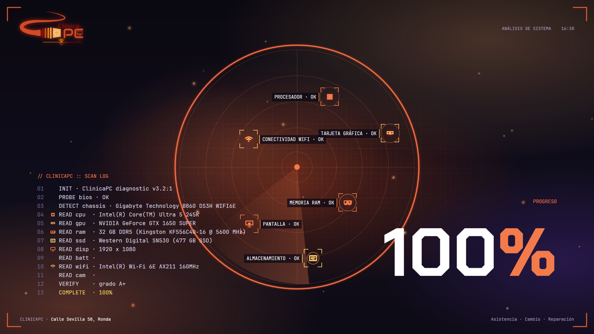

### 3. Machine spec sheet
The meat of it: detected specs, price (with optional discount), machine identity and QR.

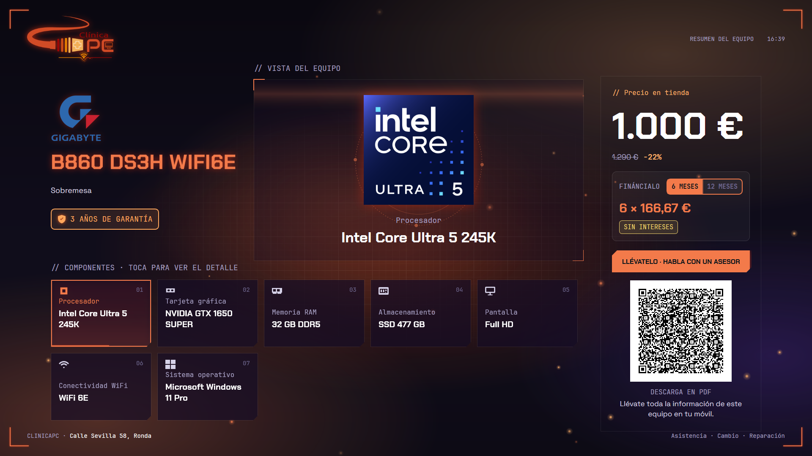

### 4. Component detail
Tap any spec and its expanded explanation opens: what it is, why it matters and where it lands on an honest scale (from basic to top-of-the-line), with its real score and a couple of things you'll actually notice day to day.

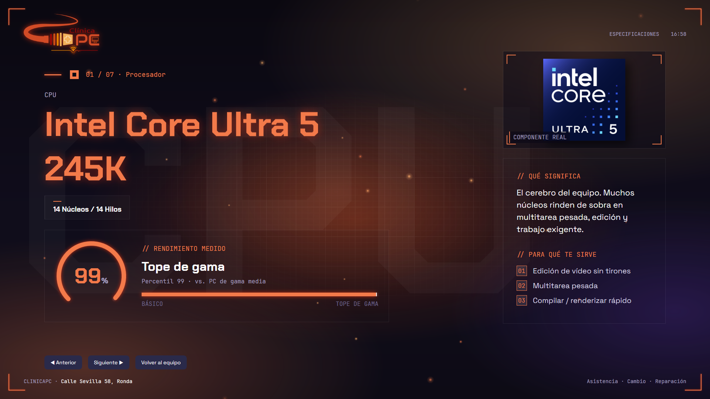

### Spec sheet on the customer's phone
The QR opens a page that **generates the PDF right on the phone**. The specs travel inside the QR,
so there's no need for internet at the shop nor a server to store anything. The sheet carries the shop's address,
email, phone and WhatsApp, clickable to message or call on the spot.

<!-- TODO: add docs/screenshots/05-pdf-movil.png — phone showing the generated PDF sheet. -->

---

## Built for a shop

- **Free editing without coding** — Settings → "Enable free edit mode" → click any text and change it in place.
- **Automatic detection** — CPU, cores, RAM, GPU, storage, display, OS, battery, WiFi, camera and the real identity (manufacturer/model). Whatever the machine doesn't have isn't shown. And if something doesn't convince you, override it by hand.
- **Scores without lying** — each component gets a score and a tier ("balanced", "top-of-the-line"…) computed from the real hardware, placed on a scale from basic to top. No made-up numbers.
- **A price that sells** — price, discounted price and 6/12-month interest-free financing. The warranty (3 years new · 1 year second-hand) sets itself based on the machine's condition.
- **Your brand, your machine** — shop, address, attract slides (one deck for new, another for second-hand) and a photo of the machine itself that you drag into the kiosk.
- **A real kiosk mode** — starts by itself with Windows, hides the taskbar, blocks Task Manager and keeps the screen always on. Nobody gets out without the password.
- **Looks good on any machine** — the effects (blur, particles) scale themselves down on weak machines.

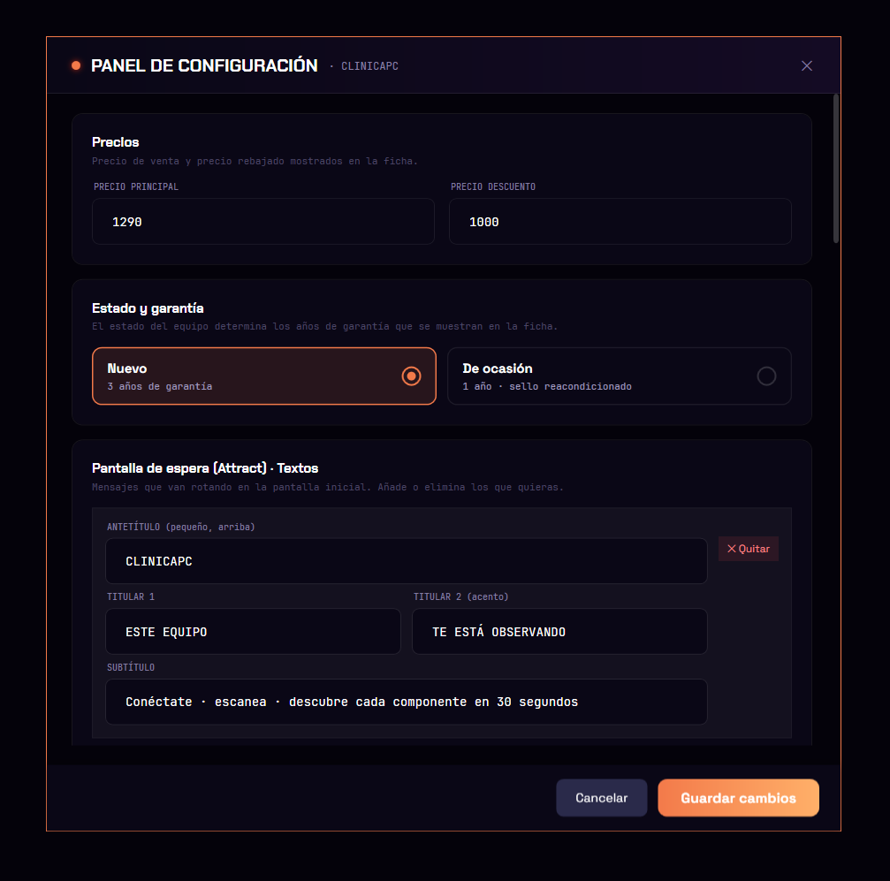

---

## How it's used

| Action | How |
|---|---|
| Open Settings | **3 clicks** in the top-right corner → password |
| Exit the kiosk | Settings → "Exit kiosk" |
| Free edit mode | Settings → "Enable free edit mode" |

Default password: `clinicapc2025` (changed in Settings → Security).

---

## One panel for the whole shop *(optional)*

A single machine on the counter needs nothing more than the app. But a shop with several kiosks
would have to walk to each one to change a slide or a message. So there's now an **optional server**:
one small web app you run once (on a mini-PC in the back room or a cheap VPS) that every kiosk reads from.

Point a kiosk at the server and the deal is simple:

- **The shop owns the shared stuff** — brand, address, phones, attract slides, on-screen texts and the
  image library are edited **once, in the panel**, and every kiosk picks them up **live**, without touching them.
- **Each machine keeps what's its own** — the **price, the condition and the auto-detected specs** are
  per-machine and the server never overwrites them. A kiosk on an RTX gaming tower and one on a used
  laptop share the same marketing but show their own hardware and their own price tag.
- **Nothing goes dark, ever** — if the server is down or the network drops, each kiosk falls back to the
  last content it cached. It keeps running as if nothing happened.
- **The attract loop marches in step** — all the kiosks in the room show the same slide at the same time,
  synced to a master clock on the server. A wall of screens, one heartbeat.

You reach the panel from any browser, log in once, and you're in.

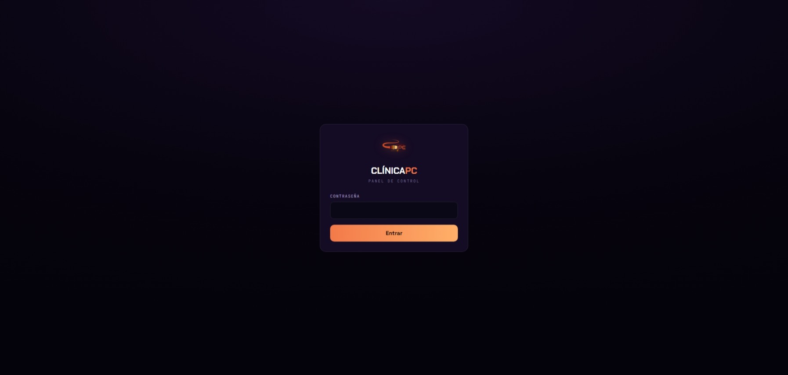

### The dashboard
At a glance: how many kiosks are online, what each is showing, and quick access to everything.

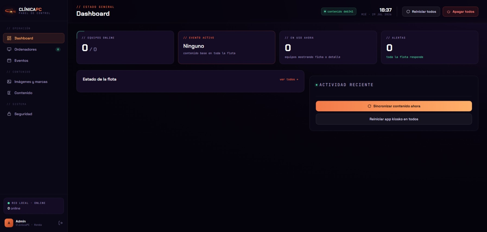

### Editing the shared content
The shop's identity, the marketing texts, the on-screen labels — all edited here and pushed to every kiosk.

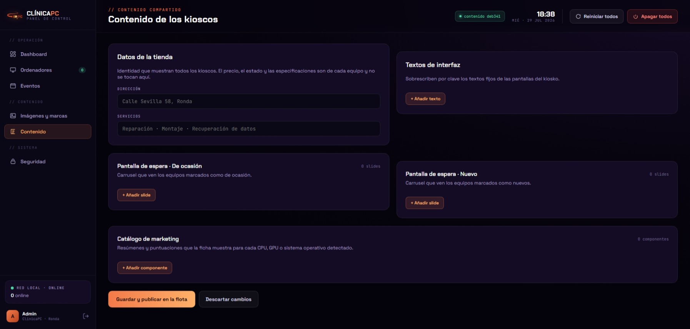

### Scheduled events
Set up a promo ("Back to school", a weekend sale) with a date range. The server serves the event's content
while it's live and rolls back on its own when it ends — evaluated in the **shop's** local time, not the server's.

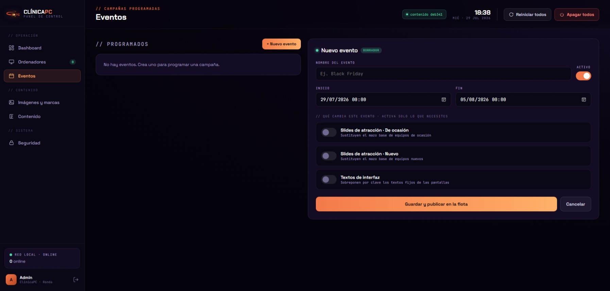

### The image library
Brand logos and component images, uploaded once and shared with every kiosk (bitmaps only — no SVG, on purpose).

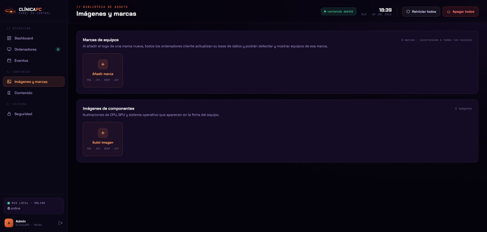

### The fleet
A live view of every kiosk in the shop — connection status, current screen, hardware and price.
Each kiosk reports over SignalR, and the panel can rename it, change its displayed price, restart the app,
restart or shut down the machine. Shop-wide restart and shutdown controls are available from every page.

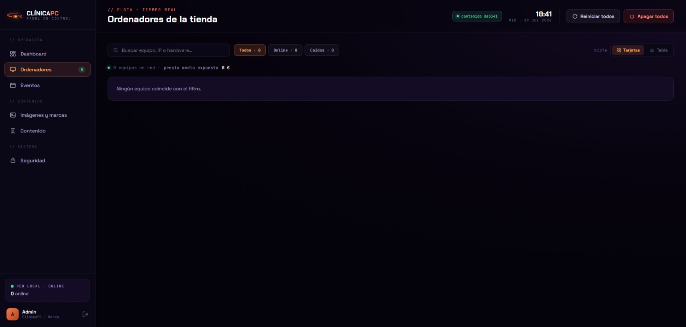

### Security
Change the panel password, check the server's current state and review recent successful, failed or
throttled login attempts.

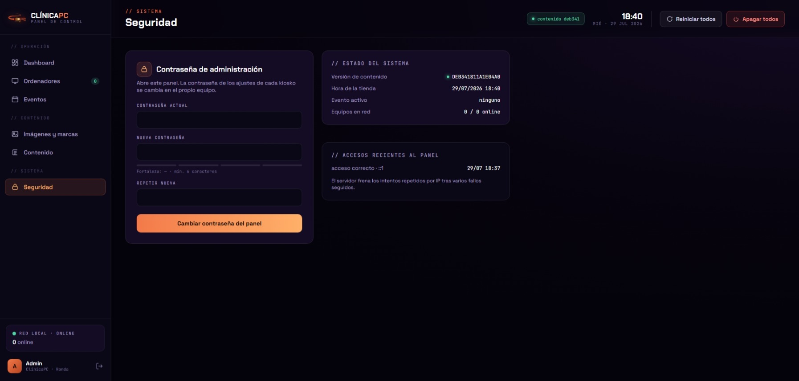

> Setting the server up (where to host it, the API key, the store's time zone) is written up in
> **[docs/SERVIDOR.md](docs/SERVIDOR.md)**.

---

## The technical part (just out of curiosity)

None of this is needed to use it, but in case you're curious:

- **Three parts, one solution.** `Kiosk.Client` (the WPF app), `Kiosk.Server` (the optional web app + admin panel) and `Kiosk.Shared` (the content models and sync messages both sides speak). A machine runs the client alone just fine; the server only adds the shop-wide layer.
- **WPF + .NET 8**, home-grown MVVM, no external frameworks. A single window; 4 "screens" that swap in and out.
- **Client ↔ server, without a single point of failure.** The client merges the server's *shared* content over its own *local* content (`SharedContent` draws the line: shop/slides/texts from the server, price/specs per-machine). If the server can't be reached it uses the last cached copy. Live updates come over **SignalR**: the panel pushes a "content changed" ping the moment you save, with slow version-polling as a backstop.
- **The attract loop is clock-synced.** The server keeps a master clock; each kiosk computes the same slide index from it (correcting clock drift), so a row of screens stays in step without the server pushing every slide change.
- **The admin panel is Blazor Server**, cookie login for a single manager, brute-force throttled. Content lives as JSON files on the server (no database); the image library rejects SVG on purpose (stored-XSS in the preview).
- **The QR still uses no internet.** The specs are compressed (gzip) and put into the URL's `#hash`. The phone decodes it and builds the PDF with JavaScript (`html2pdf.js`). Nothing about the machine is ever sent anywhere. The web page lives in `docs/` (GitHub Pages).
- **Hardware is read via WMI** in the background so the UI doesn't freeze.
- **Fixed 1920×1080 canvas** inside a `Viewbox`, so it scales cleanly to any resolution.
- **Adaptive graphics quality**: it detects software rendering / GPU without acceleration and dials down blurs and particles.
- **Persistence**: the client keeps content, behaviour and last hardware as JSON in `%LOCALAPPDATA%\KioskClinicaPC\`; the server keeps shared content, events, panel password and the image library under its own `data/` + `assets/`.

<!-- SHOT (optional): a simple client ↔ server diagram — kiosks reading /api/config and /hub/sync from the server -->

### Building

.NET 8. Needs the SDK (not just the runtime):

```
dotnet build KioskClinicaPC.sln -c Release      # everything
dotnet run   --project src/Kiosk.Server         # just the server (dev)
```

Client output: `src\Kiosk.Client\bin\Debug\net8.0-windows\KioskClinicaPC.exe` (the WPF project is `net8.0-windows`).
Server setup and deployment: **[docs/SERVIDOR.md](docs/SERVIDOR.md)**.

> ⚠️ Running it enters kiosk mode: it hides the taskbar and blocks Task Manager.
> To exit cleanly use Settings → "Exit kiosk" or `Ctrl+Shift+K`. Killing the process leaves the desktop locked.

---

<div align="center">
<sub>Made for ClinicaPC.</sub>
</div>
